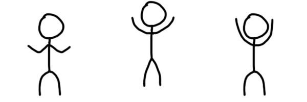

# Pocket Neko
可能单身程序员都需要养个宠物吧。

诚招一位单身程序员帮我写文档（不

（所以这种README存在于commit记录里真的好吗（逃

总之本UP主正致力于**造出一个只要修改config文件就能自主养猫的轮子** （划重点

（虽然说难道不是使用Shimeji之类的桌宠插件就可以了吗（逃

（嗯，对，就是一个自用的web桌宠框架（好想当网红啊，诚招一位~~单身~~撰稿人帮我推广（不

## Development Updates

### Animation System
**(1) Animation**: 



hmmmm一个动画基本上就是这样了吧（喂

|| Description |Example|
|---|---|---|
|`src` | Path to the image file. | "img/doodle-jump.jpg" |
|`len` | Total number of key frames. | 3 |
|`width` `height` | Width and height of a single frame (in px). | 200 200 |
|`pivotX` `pivotY` | Pivot position (in px). | 100 200 |
|`fps` | Frames per second. | 5 |
|`timestamps` | The number of frames that each key frame lasts for. | [1, 3, 2] |
|`loop` | Whether to loop the animation clip. | true |

**(2) Animator**

基本上就是一个清新自然不做作的节点系统吧。

节点之间的转换方式包括：

* `Next` - 非循环动画播放结束后自动跳转
* `onClick` - 点击时跳转（鉴于这是一个撸猫app，目前只打算给你们click这一个动作（不
* 将提供一个决策接口，根据你的猫的心情进行不同的跳转（接口名字还没想好（逃

Sample:

```
[JUMP] ---(stopped)---> [IDLE]
       ---(onclick)---> [JUMP]

[IDLE] ---(onclick)---> [JUMP]
```

就是这么清新自然不做作（躺
